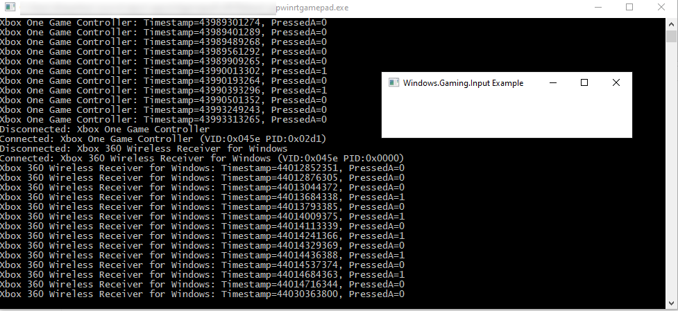

# cppwinrtgamepad
Simple test program to show how to couple [Windows::Gaming::Input](https://docs.microsoft.com/en-us/uwp/api/windows.gaming.input) API with [C++/WinRT library](https://docs.microsoft.com/en-us/windows/uwp/cpp-and-winrt-apis/) in simple Windows Application.

NOTE: Windows::Gaming::Input API is not working with Win32 pure console apps without a window because input is sent only to active window! 

